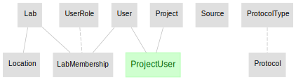
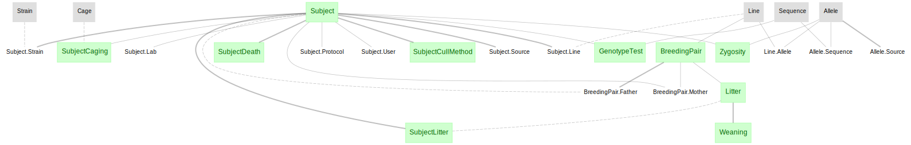
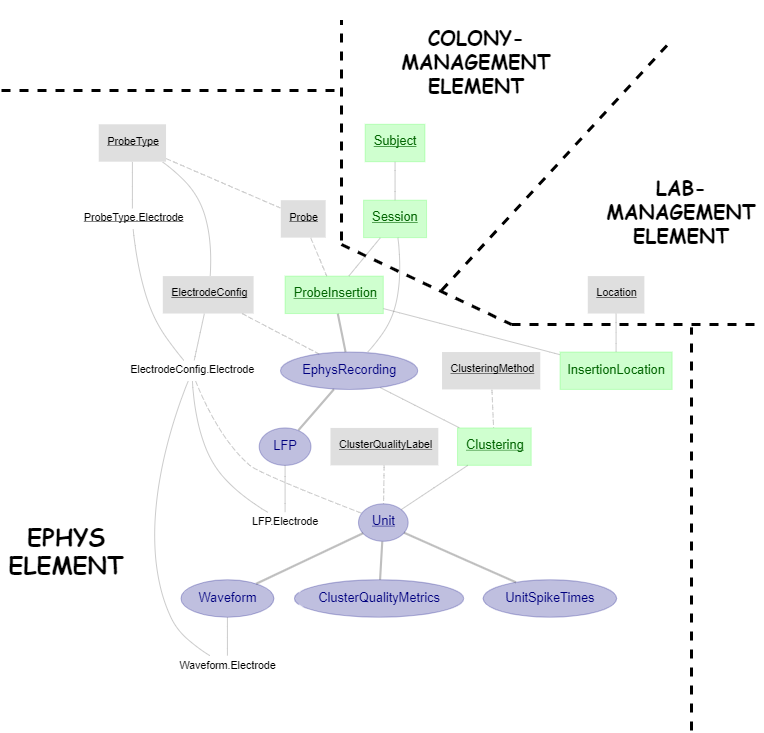

# Pipeline for extracellular electrophysiology using Neuropixels probe and kilosort clustering method

Build a full ephys pipeline using the canonical pipeline elements
+ [lab-management](https://github.com/vathes/canonical-lab-management)
+ [colony-management](https://github.com/vathes/canonical-colony-management)
+ [ephys](https://github.com/vathes/canonical-ephys)

This repository provides demonstrations for: 
1. Set up a pipeline using different pipeline modules (see [here](./my_project/__init__.py))
2. Ingestion of data/metadata based on:
    + predefined file/folder structure and naming convention
    + predefined directory lookup methods (see [here](utils/path_utils.py))
3. Ingestion of clustering results (built-in routine from the ephys pipeline module)


## Pipeline Architecture

The electrophysiology pipeline presented here uses pipeline components from 3 DataJoint pipeline elements, 
***lab-management***, ***colony-management*** and ***ephys***, assembled together to form a fully functional pipeline. 

### lab-management



### colony-management



### assembled with ephys-element



## Installation instruction

### Step 1 - clone this project

Clone this repository from [here](https://github.com/vathes/canonical-full-ephys-pipeline)

+ Launch a new terminal and change directory to where you want to clone the repository to
    ```
    cd C:/Projects
    ```
+ Clone the repository:
    ```
    git clone https://github.com/vathes/canonical-full-ephys-pipeline 
    ```
+ Change directory to ***canonical-full-ephys-pipeline***
    ```
    cd canonical-full-ephys-pipeline
    ```

### Step 2 - setup virtual environment
It is highly recommended (though not strictly required) to create a virtual environment to run the pipeline.
+ To create a new virtual environment named ***venv***:
    ```
    virtualenv venv
    ```
+ To activated the virtual environment:
    + On Windows:
        ```
        .\venv\Scripts\activate
        ```
    + On Linux/macOS:
        ```
        source venv/bin/activate
        ```
*note: if `virtualenv` not yet installed, do `pip install --user virtualenv`*

### Step 3 - Install this repository

From the root of the cloned repository directory:

    pip install .


### Step 4 - Configure the ***dj_local_conf.json***

At the root of the repository folder,
 create a new file `dj_local_conf.json` with the following template:
 
```json
{
  "database.host": "hostname",
  "database.user": "username",
  "database.password": "password",
  "database.port": 3306,
  "connection.init_function": null,
  "database.reconnect": true,
  "enable_python_native_blobs": true,
  "loglevel": "INFO",
  "safemode": true,
  "display.limit": 7,
  "display.width": 14,
  "display.show_tuple_count": true,
  "custom": {
      "database.prefix": "db_",
      "ephys_data_dir": "C:/data/ephys_data_dir"
    }
}
```

Specify database's `hostname`, `username` and `password` properly. 

Specify a `database.prefix` to create the schemas.

Setup your data directory following the convention described below.

### Step 5 (optional) - Jupyter Notebook
If you install this repository in a virtual environment, and would like to use it with Jupyter Notebook, follow the steps below:

Create a kernel for the virtual environment

    pip install ipykernel
    
    ipython kernel install --name=full-ephys

At this point the setup/installation of this pipeline is completed. Users can start browsing the example jupyter notebooks for demo usage of the pipeline.

    jupyter notebook

## Directory structure and file naming convention

The pipeline presented here is designed to work with the directory structure and file naming convention as followed

```
root_data_dir/
└───subject1/
│   └───session0/
│   │   └───imec0/
│   │   │   │   *imec0.ap.meta
│   │   │   └───ksdir/
│   │   │       │   spike_times.npy
│   │   │       │   templates.npy
│   │   │       │   ...
│   │   └───imec1/
│   │       │   *imec1.ap.meta   
│   │       └───ksdir/
│   │           │   spike_times.npy
│   │           │   templates.npy
│   │           │   ...
│   └───session1/
│   │   │   ...
└───subject2/
│   │   ...
```

+ ***root_data_dir*** is configurable in the `dj_local_conf.json`,
 under `custom/ephys_data_dir` variable
+ the ***subject*** directories must match the identifier of your subjects
+ the ***session*** directories must match the following naming convention:
 
    `*subject_mmddyy_HHMMSS*`  (where `mmddyy_HHMMSS` is the datetime of the session)
    
+ the ***probe*** directories must match the following naming convention:

    `*imec[0-9]` (where `[0-9]` is a one digit number specifying the probe number) 
    
+ a neuropixels meta file is required per probe folder, with the following naming convention:

    `*imec[0-9].ap.meta`
    
    
## Running this pipeline

Once you have your data directory configured with the above convention,
 populating the pipeline with your data amounts to these 3 steps:
 
1. Insert meta information - modify and run this [script](my_project/insert_lookup.py) to insert meta information (e.g. subject, equipment, etc.)
2. Import session data - run:

    python my_project/ingestion.py
    
3. Import clustering data and populate downstream analyses - run:

    python my_project/populate.py
    
Rerun step 2 and 3 every time new subjects, sessions or clustering data become available.
In fact, step 2 and 3 can be executed as scheduled jobs
 that will automatically process any data newly placed into the ***root_data_dir***
 
